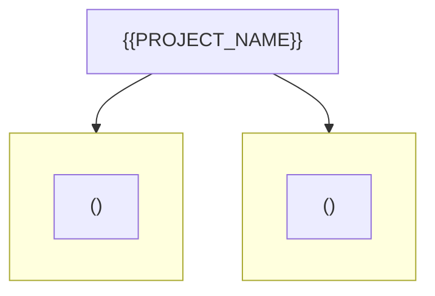
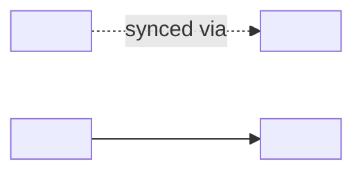

# {{PROJECT_NAME}} — Repository Topology Map

> Auto-generated by `repo-doc-miner/scripts/gen_topology.py` (v2, topology-first), then **human-refined**. This is the **first deliverable** of the mining process: a structural map of the repository. Keep this file open while writing the other three documents.

---

## 1. Structural Topology

> Top-level structure: each subgraph is a top-level module; nodes are the entities it contains, color-coded by kind.

## 2. Dependency Edges

> Solid arrows = `uses`; dotted arrows = `source → copy` (a single source of truth synced into copies). The `source → copy` edges are the most important — they reveal duplication that flat file scanning would misinterpret.

| Edge | Mechanism | How to verify |
| --- | --- | --- |
| `<source> → <copy>` | `<what syncs them, e.g. sync-agent-skills.py or system.file:>` | `<script/field to check>` |
| `<a> → <b>` | `<relationship>` | `<how to confirm>` |

## 3. Entity Inventory

| Kind | Count | Location |
| --- | --- | --- |
| `<kind>` | `<n>` | `<path-glob>` |

## 4. Module Deep-Dive Notes

> Filled during Phase 2 (module deep-dive), walking modules **along the edges above**, highest complexity first.

### <module-a>

- **<entity>** (`<kind>`) — `<path>`
  - Responsibility: `<one-liner>`
  - References: `<entities this one points to>`
  - > TODO(doc-miner): `<any gap>`

### <module-b>

- **<entity>** (`<kind>`) — `<path>`
  - Responsibility: `<one-liner>`

---

> This map is the backbone for `developer_guide.md`, `user_guide.md`, and `tutorial.md`. Re-run `scripts/gen_topology.py` to diff structural changes as the repo evolves.
